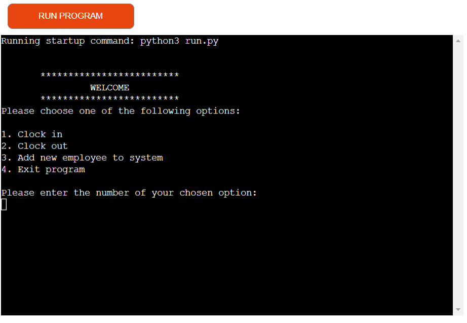
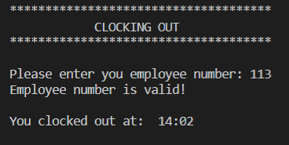
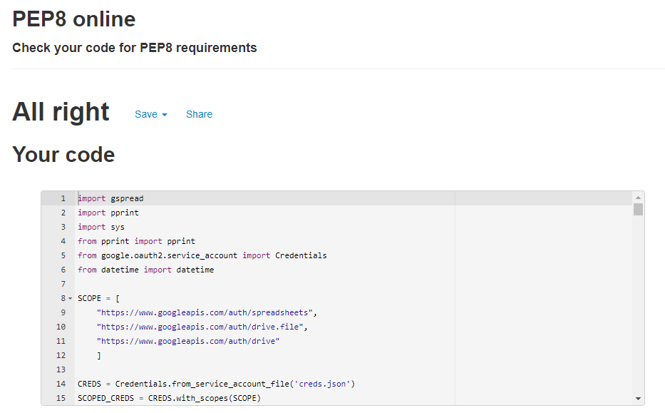

# Employee Clock in System
(Developer: Devan Hayes)
[Employee Clocking System Live](https://employee-clocking-system.herokuapp.com/)

## Tables of Contents
1. [Project Goals](#project_goals)
    1. [User Experience](#user_experience)
    2. [Target Audience](#target_audience)
    3. [User Stories](#user_stories)
    4. [Business Owner Stories](#business_owner_stories)
2. [Features](#fearutes)
    1. [Options Menu](#options_menu)
    2. [Clock-in](#clock_in)
    3. [Clock-out](#clock_out)
    4. [Exit](#exit)
    5. [User Input Validation](#user_input_validation)
3. [Languages](#languages)
4. [Frameworks and Tools](#frameworks_and_tools)
5. [Bugs](#bugs)
6. [Testing](#testing)
7. [Validator Testing](#validator_testing)
8. [Deployment](#deployment)
9. [Credits](#credits)

## Project Goals
Employee Clock In System is a program that allows employees of a business to clock in and out. This facilitates the owners with the necessary data they need to track the employees' hours.

### User Experience
The user first decides which option they would like to do, then a google sheet is updated with the data. 

### Target Audience
- Bussiness' that would like to track employee clock in and out times

### User Stories
1. As a user, I want to log the exact time of arrival.
2. As a user, I want to log the exact leaving time.

### Business Owner Stories
1. As a busisness owner, I want to track all of my employees working hours.
2. As a busisness owner, I want to be able to add new employees to the program.

## Features
### Options Menu
    - The options menu has four options to choose from.
        - Option one allows the user to clock in by entering their employee number.
        - Option two allows the user to clock out.
        - Option three allows the user to add new employees to the list of current employees
        - Option four allows the user to quit running the program.

### Clock-in (Option One)
    - The clock-in option allows an existing employee to enter their employee number.
    - The nubmer runs through a validation function to check the correct lenght of the number entered.
    - This then creates a new row in the Google Sheet (employee_clocking_system) and inputs the employees number, name and time of clock in.

### Clock-out (Option Two)
    -The clock-out option allows a user who has already clocked in to add a clock-out time to the row created in the clock-in section (Google Sheets)

### Create New Employee (Option Three)
    - This option allows the user to add a new employee to the list.
        - First the user is prompted to enter a user name.
        - Next the user is prompted to add the hourly rate of the new employee.
        - Finally the new user is assigned an employee number and a new employee has been successfully added to the list

### Exit (Option Four)
- The Exit option allows the user to end the program.

### User Input Validation 
- The input validation checks has the user entered the correct amount of digits.
- If the incorrect amount of digits is entered the user an error message will be displayed in the terminal

## Languages
- Python 3

## Frameworks and Tools
- gitHub
- Gitpod
- Git

## Bugs
| **Feature / Function** | **Expected Result** | **Actual Result** | **Action** |
|-------------|------------|---------------------|-------------------|
| find_last_employee_entry()| It would count employee numbers | ValueError: invalid literal for int() | The first cell was a heading. This was fixed by using indexing to begin at the second cell [1:]|
|transfer_of_data()| To revieve input from the user and update google sheets | TypeError: can only concatenate list (not "str") to list | To concatenate the two variables I needed to format the string type into a list. Example: csv_result = employee_details + [clockin_time]

## Testing

| **Feature** | **Action** | **Expected Result** | **Actual Result** |
|-------------|------------|---------------------|-------------------|
|Options Menu| Run the program, choose all menu options one by one| That the option selected by the user would execute.| As expected |
| Clock in | Type in a correct employee number | Update Google Sheets with  employee number, name and time of clock in | As expected |
| Clock out | Type in a correct employee number | Find where the employee signed in Update Google Sheets clock out cell with the current time | As expected |
| Exit | Choose the exit option | This will terminate the program | As expected |

## Validator Testing 
### PEP8 Validation
- The PEP8 Valitator has resulted in no errors or warnings

## Deployment
Heroku was used for the deployment of this program.
1. In the workspace terminal command line: "pip3 freeze > requirements.txt"
2. Create account on Heroku
3. On the dashboard page, select "create new app"
4. Click create app
5. Go to the "settings" tab, find "Config Vars" enter "Creds" into the key field and copy the contents for the creds.json file into the value field
6. In setting find add buid packs to app
    1. python
    2. node.js
6. Scroll up to the navigation menu and find "deploy", select GitHub as deployment method
7. In the Deployment Method section select Gitub or connect to GitHub
8. In the "Connect to GitHub, searh the desired repository
9. Enable automatic deploys and then deploy branch
10. Once deployed click on "View" to open aplication

## Credits
### Code
- To implement time into the program I used https://www.programiz.com/python-programming/datetime/current-time 
- To find additonal features working with Google Sheets I used https://www.youtube.com/watch?v=yPQ2Gk33b1U&ab_channel=PrettyPrinted 

